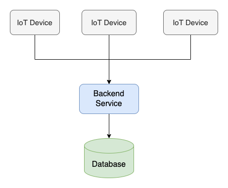
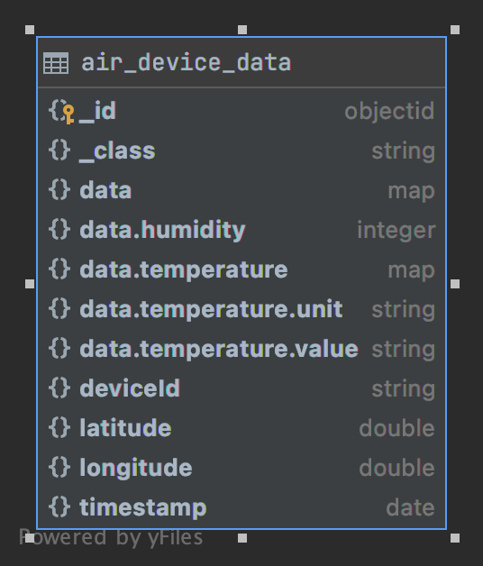

# IoT Backend

## Build & Run

To build executable jar file, use:
```bash
./gradlew clean bootJar
```

To run test:
```bash
./gradlew clean test
```

To do both:
```bash
./gradlew clean build
```

To run the service:
```bash
./gradlew clean bootRun
```
or if you use IntelliJ, it will detect application entry point. But make sure you have a MongoDB container is running on your local environment.
You can do that by:

```bash
./gradlew composeUp
```

## Application design 
The most significant property of the requirement is high write workload.
I concerned about several Relational DBMS I've worked with such as MySQL, PostgreSQL but seems they're not really fit for a high write workload that have to finish in 9 hours.

Almost SQL DBMS will validate data before insert to storage space. Default isolation level of MySQL is `snapshot`, PostgreSQL is `read committed`. Of course, we can do turning for it but why don't we choose a NoSQL DBMS that has good support for high write.

So I chose MongoDB, although I haven't worked with it. But after Googling, I found that MongoDB support high write through:
- `Read uncommitted` as default isolation level https://docs.mongodb.com/manual/core/read-isolation-consistency-recency/#read-uncommitted
- MongoDB supports flexible schema, so it doesn't have many constrains on field validation, so is doesn't slow down insert operation.

About distributed database, it's risk to do in 9 hours.

Application design is simple. I have a Java web application that connect to a MongoDB to store data.
The web application can scale by add more instances. The MongoDB can scale by add more resource, use sharding or replication.



## Database schema diagram
In MongoDB database, I created a collections that has schema following class `AirDeviceData`.
I also added index for these field: `deviceId`, `timestamp`. Because these field will be used to query and sort data.
For more detail, please check `docker/init-mongo.js`.

| key | name | v |
| :--- | :--- | :--- |
| {"\_id": 1} | \_id\_ | 2 |
| {"deviceId": 1, "timestamp": 1} | deviceId\_1\_timestamp\_1 | 2 |




## Code structure
I divided code to several packages base on its responsibility.

## Coding rule to achieve code quality
- When I meet a class that seems complicated, I will try to refactor it by split out functionality.
- Small class made writing unit test easier.
- No complicated static method.
- Refactor code base on unit test.

## Summary breakdown
- Preparation: 4 hours (research)
- Coding: 3 hours (including tests)
- Documentation: 2 hours
- Verify: 1 hours
- Grand total: 10 hours
